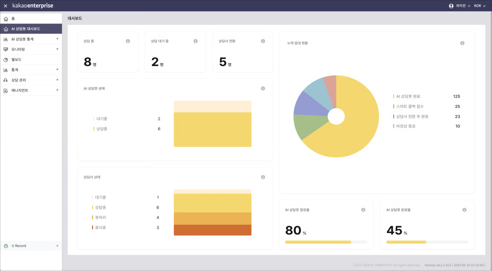

# AI 상담봇 대시보드

## AI 상담봇 대시보드 

AI 상담봇 대시보드는 AI 상담봇과 관련한 현황을 한눈에 보여 줍니다.

<figure><figcaption>
AI 상담봇 대시보드
</figcaption></figure>

<table><thead><tr><th width="158.33333333333331">카테고리</th><th width="481">설명</th><th> </th></tr></thead><tbody><tr><td>상담 중</td><td>현재 AI 봇과 상담 중인 고객의 수</td><td></td></tr><tr><td>상담 대기 중</td><td>AI 상담봇과 통화를 하다 상담사로 전환을 요청하여 대기 중인 고객의 수</td><td></td></tr><tr><td>상담사 전환</td><td>AI 상담봇과 통화를 하고 상담사로 전환이 되어 상담사와 통화를 하고 있는 고객의 수</td><td>대시보드</td></tr></tbody></table>

### AI 상담봇 상태

전체 상담봇 수(채널 수) 중 현재 상담 중인 상담봇과 대기 중인 상담봇의 수를 보여줍니다.

### 상담사 상태

현재 로그인한 상담사를 기준으로 현재 상태를 보여 줍니다. AI 상담봇과 비교하여 현황을 확인할 수 있습니다.

### 누적 응대 현황

금일 00시부터 현재까지 AI 상담봇이 응대한 실적을 누적하여 보여줍니다.

<table><thead><tr><th width="177.33333333333331">카테고리</th><th width="470">설명</th><th> </th></tr></thead><tbody><tr><td>AI 상담봇 완료</td><td>상담사 전환 없이 숏헤드 인텐트 응대만으로 종료된 콜 수</td><td></td></tr><tr><td>스마트 콜백 접수</td><td>스마트 콜백이 접수된 수 (IVR 콜백 포함)</td><td></td></tr><tr><td>상담사 전환 후 완료</td><td>AI 상담봇과 통화 중 상담사로 전환하여 통화 종료된 수</td><td>대시보드</td></tr><tr><td>비정상 종료</td><td>정상적으로 통화가 종료되기 전, 고객이 먼저 통화 종료한 수</td><td></td></tr></tbody></table>

### AI 상담봇 점유율

신청한 봇 채널이 얼마나 이용되고 있는지 보여주는 지표입니다. 점유율이 낮을수록 채널에 비해 봇이 적게 사용되고, 그 비율이 높을수록 채널에 비해 봇이 많이 사용되고 있는 것으로, 항상 높은 비율을 유지한다면 봇이 더 많은 고객을 응대할 수 있도록 봇 채널 수를 늘리는 것이 좋습니다.

### AI 상담봇 완료율

전체 콜 인입 중 AI 상담봇만으로 상담을 완료한 비율입니다. 상담사 전환 없이도 고객의 문의를 상담봇이 얼마나 많이 처리하고 있는지 보여주는 지표입니다.
