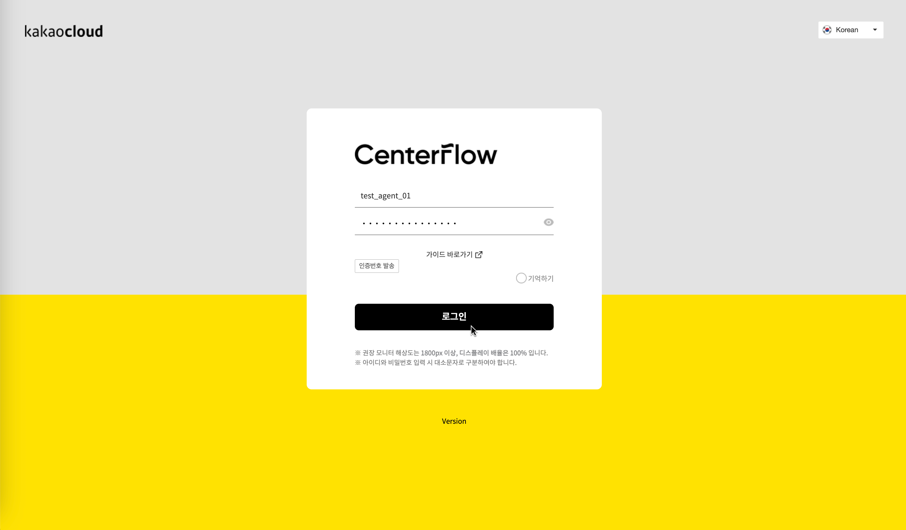
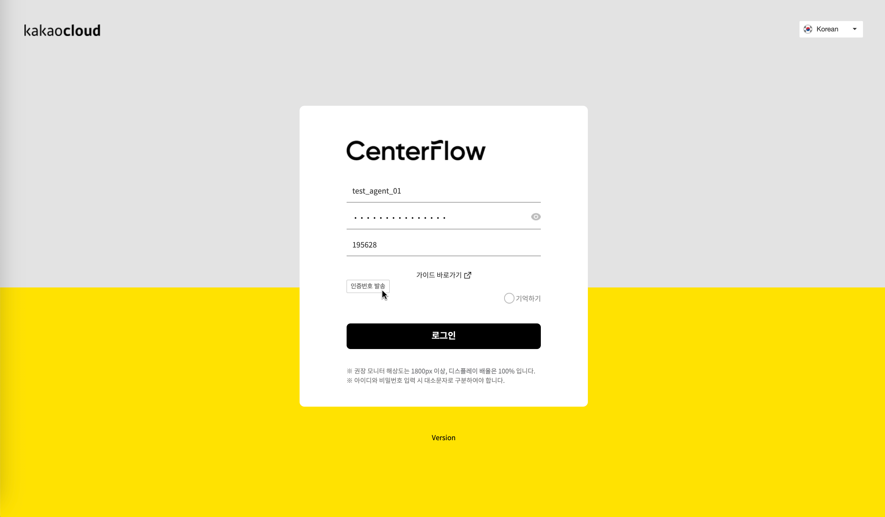

# 상담 애플리케이션 로그인하기

## login로그인

상담 애플리케이션의 경우 시스템 보안을 위해서 IP 또는 http 접속은 제한하고 `https://도메인` 형태로 접속해야 합니다.


**접속 URL**\
[**https://csappnew.centerflow.ai/agent**](https://csappnew.centerflow.ai/agent)


상담 애플리케이션의 경우 상담사ID, 비밀번호를 이용하여 로그인 인증 절차를 수행합니다.

<figure><figcaption>
상담 애플리케이션 로그인
</figcaption></figure>

<table><thead><tr><th width="144">No</th><th>용도</th></tr></thead><tbody><tr><td>상담사 ID</td><td>센터플로우 사용자에게 부여된 상담사 계정 ID</td></tr><tr><td>내선</td><td>전화 상담 업무를 수행할 자리 내선 번호 - 상담사가 자리를 이동하여 상담업무를 수행할 수 있으므로, 실제 상담 통화가 가능한 내선 전화번호 입력 - 입력한 내선 전화가 미등록, 통화 상태일 경우 상담 애플리케이션 사용에 제한 발생</td></tr><tr><td>비밀번호</td><td>상담사 계정의 비밀번호 </td></tr><tr><td>기억하기</td><td>로그인 화면에서 입력한 정보(상담사ID, 내선, 비밀번호)를 저장했다가 다음 번 로그인 시 별도 입력 없이 사용 가능   - 웹 브라우져의 캐시를 삭제할 경우 초기화 되며, 공용PC를 이용하여 상담업무를 수행할 경우 해당 설정은 반드시 비활성화한 상태로 사용</td></tr></tbody></table>


**안내**

상담 애플리케이션 로그인 화면이 표시되지 않을 경우 상담 애플리케이션의 방화벽 설정(접속 허용 IP)이나 PC의 hosts설정(사내망에서는 공인IP로 접속 불가 / 사내IP로만 접속 가능)을 확인하시기 바랍니다.


**1) 최초 로그인 시 비밀번호 재설정**

테스트 가능 안내 이메일에 첨부된 엑셀 파일에서 상담앱 계정의 ID와 패스워드 리스트를 확인하여, 로그인해 주세요. 상담사용 계정과 어드민 계정의 ID/PW가 안내됩니다.&#x20;

최초 로그인 시 비밀번호를 재설정해야합니다.&#x20;

**2) 비밀번호를 잃어버렸을 경우**

회사 관리자에게 요청하면 비밀번호를 재설정할 수 있습니다. [계정 활성화 방법](https://kakaoenterprise.gitbook.io/kicc/guide/counselling/admin/management)을 참고해 주세요.

**3) 비밀번호 오류 5회 이상인 경우 접속 제한**

상담 애플리케이션 어드민 로그인 시도 중 비밀번호를 5회 이상 실패할 경우, 관리자(admin 계정 소유자)에게 계정 활성화를 요청해야 합니다.

[계정 활성화 방법](https://kakaoenterprise.gitbook.io/kicc/guide/counselling/admin/management)을 참고하여 계정을 활성화하실 수 있습니다.

<figure><figcaption></figcaption></figure>

**3) 중복 로그인에 의한 접속 제한**

상담 애플리케이션 사용 중에 비정상적으로 종료(로그아웃을 하지 않고 웹 브라우져 종료)한 경우 중복 로그인 경고 팝업창이 나타날 수 있습니다.

팝업창에서 **확인(재접속)**&#xC744; 클릭하면, 기존 접속은 강제 종료되고 마지막에 접속을 시도한 세션에 대해서만 정상적인 사용이 가능합니다.

<figure><figcaption>
중복 로그인 접속 제한
</figcaption></figure>

## 정보 보안 강화 로그인

**1) 로그인 접속 IP 관리**

상담사별 접속 IP를 관리하여 허용된 IP에서만 정상 로그인이 가능하고, 이외 IP에서는 정상 로그인이 불가하도록 하는 정보 보안 강화 기능입니다. [상담앱 어드민의 상담사별 계정정보 관리 화면](../admin/management.md)에서 접근을 허용할 IP를 사전에 설정하여야 합니다. (어드민에서 접근을 허용할 IP를 등록하면, 로그인 시 접속 IP관리 기능이 바로 적용됩니다.)

<figure><figcaption>
타 IP 에서는 정상 로그인 불가
</figcaption></figure>

**2) 로그인 인증번호 2차 인증**

상담사 계정별 설정된 모바일 전화번호로 인증번호를 발송하여 정확한 인증번호가 입력된 상황에서만 정상 로그인이 가능하도록 하는 정보 보안 강화 기능입니다. [상담앱 어드민의 상담사별 계정정보 관리 화면](../admin/management.md)에서 인증번호를 수신할 모바일 전화번호를 사전에 설정하여야 합니다. (적용 필요 시 '기술지원문의'를 통해 문의 남겨주시면, 적용 완료 후 별도로 안내해 드립니다. 또한, 인증번호 발송을 위해서는 콘솔화면에서 '비즈채널' 설정이 선행되어야 합니다.)

<figure><figcaption>
ID/PW 입력 후 로그인 버튼 선택 시, '인증번호 발송'버튼 활성화
</figcaption></figure>

<figure><figcaption>
'인증번호 발송'버튼 선택 시, 모바일로 인증번호 발송
</figcaption></figure>

## 상담 애플리케이션 메인 페이지 

상담 애플리케이션으로 로그인이 정상적으로 된 경우 아래와 같은 메인 페이지를 확인할 수 있습니다. 메인 페이지는 콜 상담 업무가 가능한 **콜** 탭입니다.

<figure><figcaption>
메인페이지 메뉴 구성
</figcaption></figure>

상담 애플리케이션 메뉴는 아래와 같이 구성됩니다.

<table><thead><tr><th width="222">메뉴명</th><th>세부 내역</th></tr></thead><tbody><tr><td>① 메인 메뉴 Tree</td><td>상담사 애플리케이션에서 사용 가능한 메뉴 Tree</td></tr><tr><td>② 전화 기능</td><td>상담 통화시 전화(WebRTC)기능에 대한 제어와 상담사의 상태(대기,휴식)를 변경을 위한 영역</td></tr><tr><td>③ 상담 고객 정보</td><td>상담 통화를 실시한 고객의 정보를 저장 및 확인 하기 위한 영역</td></tr><tr><td>④ 상담 결과</td><td>상담 통화 완료 시 상담 결과를 저장하기 위한 영역</td></tr><tr><td>⑤ 상담사별 상담 리스트</td><td>상담사별 상담내역, 재연락, 콜백, 캠페인을 확인하기 위한 영역</td></tr><tr><td>⑥ 고객별 상담 내역</td><td>고객별 상담 내역을 제공하기 위한 영역</td></tr></tbody></table>

메인 메뉴 Tree는 아래와 같이 구성되어 있습니다.

<table><thead><tr><th width="163.33333333333331">메인 메뉴</th><th width="136">서브 메뉴</th><th>설명</th></tr></thead><tbody><tr><td>상담하기</td><td>콜</td><td>콜 상담(인바운드/아웃바운드)을 진행하고 콜 상담 결과를 저장</td></tr><tr><td></td><td>비상담 업무</td><td>콜과 채팅 상담 이외의 다른 채널(이메일,SMS)로 인입된 상담을 진행하고 상담 결과를 저장</td></tr><tr><td>상담 리스트</td><td>상담 리스트</td><td>상담사 기준으로 상담 업무를 수행한 이력을 확인</td></tr><tr><td>콜백</td><td>콜백 조회</td><td>IVR 장치에서 수집된 콜백 목록을 조회</td></tr><tr><td></td><td>콜백 분배</td><td>등록된 콜백에 대해서 상담사별로 분배</td></tr><tr><td>상담사 관리</td><td>상담사 관리</td><td>상담사 목록을 확인</td></tr></tbody></table>

### 상담사 상태 

상담 애플리케이션의 경우 상담사 상태를 총 4개(대기 중, 상담 중, 후 처리, 휴식)로 구분합니다. 후 처리와 휴식은 세부 상태를 10개까지 구분이 가능하며 세부 상태는 상담 애플리케이션 어드민에서 설정합니다.

<table><thead><tr><th width="111.33333333333331">상담사 상태</th><th width="139">상담사 세부 상태</th><th>설명</th></tr></thead><tbody><tr><td>대기 중</td><td>-</td><td>인바운드 상담전화를 받을 수 있는 상태</td></tr><tr><td>상담 중</td><td>발신 중</td><td>아웃바운드 상담 전화를 시도 중인 상태</td></tr><tr><td></td><td>통화 중</td><td>고객과 상담전화(인바운드/아웃바운드)가 연결되고 상담사가 상담을 진행 중인 상태</td></tr><tr><td>후 처리</td><td>일반 후처리</td><td>인바운드/아웃바운드 상담을 완료하고 상담 결과를 저장하거나 상담과 관련된 추가적인 업무를 진행중인 상태 후처리 단계를 10개로 세분화 하여 설정할 수 있음</td></tr><tr><td></td><td>전산처리_1</td><td></td></tr><tr><td></td><td>문서처리_2</td><td></td></tr><tr><td></td><td>업무처리_3</td><td></td></tr><tr><td></td><td>고객상담_4</td><td></td></tr><tr><td></td><td>업무지시_5</td><td></td></tr><tr><td></td><td>협의_TEST</td><td></td></tr><tr><td></td><td>외부 문의</td><td></td></tr><tr><td></td><td>다른 업무</td><td></td></tr><tr><td></td><td>수리</td><td></td></tr><tr><td>휴식 중</td><td>일반 휴식</td><td>업무 중 휴식 시 선택할 수 있는 값으로 상담 전화를 받을 수 없는 상태. 세분화하여 선택할 수 있음</td></tr><tr><td></td><td>개인</td><td></td></tr><tr><td></td><td>식사</td><td></td></tr><tr><td></td><td>티 타임</td><td></td></tr><tr><td></td><td>교육</td><td></td></tr><tr><td></td><td>회의</td><td></td></tr><tr><td>부가 정보</td><td>상담_TEST</td><td></td></tr><tr><td></td><td>다른 업무</td><td></td></tr><tr><td></td><td>개인 업무</td><td></td></tr><tr><td></td><td>수리</td><td></td></tr></tbody></table>

아래와 같이 상담사 상태는 변경됩니다.

<figure><figcaption>
상담사 상태 변경
</figcaption></figure>

### 고객 정보 

상담 애플리케이션을 이용하여 상담 업무를 수행하게 된 경우 등록되지 않은 고객에 대해서는 상담 결과를 저장할 수 없습니다.&#x20;

* 미등록된 고객으로부터 상담 업무를 요청 받은 경우 상담사는 고객정보를 우선 생성하고 상담 업무를 진행해야 합니다.

<figure><figcaption>
고객 정보
</figcaption></figure>

고객 정보는 기본 정보와 부가 정보로 구분됩니다.

* 기본 정보는 고객을 구분하기 위한 최소한의 정보를 의미하여, 고객명과 고객전화번호는 필수 입력해야 합니다. 부가 정보는 기본 정보에 포함되지 않는 정보를 저장하기 위한 것으로 최대 40개까지 등록이 가능하고 이중 14개를 선택해서 사용 가능합니다.
* 고객 부가 정보는 **상담 애플리케이션 어드민**의 **상담관리 > 상담관리 > 고객 정보** 메뉴에서 설정 가능합니다.

<table><thead><tr><th width="108.33333333333331">구분</th><th width="142">필드명</th><th>설명</th></tr></thead><tbody><tr><td>기본 정보</td><td>고객명(필수)</td><td>상담 고객 이름(최대 24글자) - 한글 이름 입력 시 최대한 한글 맞춤법 (띄어쓰기, 두음법칙)을 적용한 형태로 작성  - “정 성용” 보다는 “정성룡”과 같이 정확한 표기</td></tr><tr><td></td><td>전화번호(필수)</td><td>인바운드 콜 상담 수신 시 발신측 전화번호(고객측 전화번호)가 표시됨</td></tr><tr><td></td><td>고객ID</td><td>신규 고객정보를 입력하고 저장을 하게 되면 고객 ID가 시스템에서 자동 할당됨</td></tr><tr><td></td><td>휴대폰</td><td>상담 고객의 휴대폰번호를 입력</td></tr><tr><td></td><td>이메일</td><td>상담 고객의 이메일 주소를 입력</td></tr><tr><td></td><td>주소</td><td>상담 고객의 집주소를 입력</td></tr><tr><td>부가 정보</td><td>부가정보</td><td>고객의 기본 정보 이외에 나이, 성별 등을 부가정보 로 등록하여 사용할 수 있음</td></tr></tbody></table>

### 상담 결과 

상담 애플리케이션에서 전화 상담이 종료(통화 종료)된 이후에 상담 결과를 저장할 수 있습니다.

* 상담 유형(대분류, 중분류, 소분류)은 상담 애플리케이션 어드민에서 설정 가능합니다.


**안내**

상담 결과 저장 시 상담유형, 통화결과, 상담메모를 필수적으로 입력해야 합니다.


<figure><figcaption>
상담 결과
</figcaption></figure>

<table><thead><tr><th width="112.33333333333331">구분</th><th width="146">필드명</th><th>설명</th></tr></thead><tbody><tr><td>상담 경로</td><td>인바운드</td><td>상담사가 대기 상태에서 인바운드 상담호가 인입되어 상담을 진행한 경우</td></tr><tr><td></td><td>인바운드 호전환</td><td>상담사가 대기 상태에서 AI 상담봇에서 호가 전환되어 상담을 진행한 경우(인바운드 호전환된 경우, 호를 전환한  콜과 상담 번호가 동일함)</td></tr><tr><td></td><td>아웃바운드</td><td>상담사가 고객 전화번호를 직접 입력하고 발신을 시도하거나 캠페인에 등록된 전화번호 등으로 아웃바운드 상담 호를 시도한 경우에 해당됨</td></tr><tr><td></td><td>재연락</td><td>재연락으로 등록된 전화번호를 선택하여 아웃바운드 상담 통화를 시도한 경우에 해당됨</td></tr><tr><td></td><td>콜백</td><td>콜백으로 등록된 전화번호를 선택하여 아웃바운드 상담 통화를 시도한 경우에 해당됨</td></tr><tr><td>상담 유형</td><td>대분류</td><td>상담 유형은 3단계로 구분이 되고 통계로 활용되는 만큼 필수로 입력해야함</td></tr><tr><td></td><td>중분류</td><td></td></tr><tr><td></td><td>소분류</td><td></td></tr><tr><td>통화 결과</td><td>완료</td><td>고객과 상담 통화가 정상적으로 완료된 경우</td></tr><tr><td></td><td>재연락</td><td>고객과 상담 통화가 완료가 되었으나 재연락이 필요한 경우에 해당됨</td></tr><tr><td></td><td>미완료</td><td>고객과 상담 통화 연결 시도는 하였으나 실제 통화가 되지 않거나 기타 이유로 미완료된 상태에 해당됨</td></tr><tr><td></td><td>업무 이관</td><td></td></tr><tr><td></td><td>민원</td><td></td></tr><tr><td>재연락</td><td>재연락 시간</td><td>재연락을 시도할 시간을 설정함</td></tr><tr><td></td><td>재연락 번호</td><td>고객 정보에 등록된 전화번호 자동으로 입력됨</td></tr><tr><td>상담 메모</td><td>-</td><td>상담 결과 항목에 없는 내용에 대해서 상담 메모를 활용할 수 있음</td></tr></tbody></table>

### 상담사별 상담 리스트 

상담사가 1일 기준으로 상담 업무를 진행한 상담 리스트와 재연락, 콜백, 캠페인 목록을 확인할 수 있습니다.

#### 상담 리스트

<figure><figcaption></figcaption></figure>

<table><thead><tr><th width="147.33333333333331">구분</th><th width="150">필드명</th><th>설명</th></tr></thead><tbody><tr><td>상담 경로</td><td>인바운드</td><td>고객으로부터 인입된 호에 대해서 상담 업무를 진행한 경우</td></tr><tr><td></td><td>아웃바운드</td><td>상담사가 고객으로 발신한 호에 대해서 상담 업무 진행한 경우</td></tr><tr><td></td><td>인바운드 호전환</td><td>AI상담봇에 고객으로부터 인입된 호를 상담원으로 전환한 경우</td></tr><tr><td>고객명</td><td></td><td>상담 업무를 진행한 고객 이름</td></tr><tr><td>고객 전화번호</td><td></td><td>상담 업무를 진행한 고객의 전화번호</td></tr><tr><td>상담 종류</td><td>콜</td><td>콜 상담 업무를 진행한 경우</td></tr><tr><td>상담 결과</td><td>완료</td><td>고객과 상담 통화가 정상적으로 완료된 경우</td></tr><tr><td></td><td>재연락</td><td>고객과 상담 통화가 완료가 되었으나 재연락이 필요한 경우</td></tr><tr><td></td><td>미완료</td><td>고객과 상담 통화 연결 시도는 하였으나 실제 통화가 되지 않거나 기타 이유로 미완료된 상태에 해당됨</td></tr><tr><td></td><td>실패</td><td>고객과 상담 통화가 정상적으로 완료되지 못한 경우</td></tr></tbody></table>

#### 재연락

상담 이력 저장 시 “상담 결과=재연락”으로 설정한 경우 **재연락** 탭에 표시됩니다. 상담사는 해당 목록을 더블 클릭하여 아웃바운드 상담 업무를 진행하고 상담 내역 저장 시 “상담결과 = 완료”로 저장하면 재연락 목록에서 삭제됩니다.

<figure><figcaption>
재연락
</figcaption></figure>

<table><thead><tr><th width="122">구분</th><th>설명</th></tr></thead><tbody><tr><td>예약 시간</td><td>재연락 시간 예약 시간이 10분 이내로 남았을 경우 빨간색으로 표시</td></tr><tr><td>고객명</td><td>재연락을 요청한 고객의 이름</td></tr><tr><td>연락처</td><td>재연락을 요청한 고객의 연락처 (고객 정보에 등록된 전화번호와 재연락 요청 번호는 다를 수 있음)</td></tr></tbody></table>

**콜백**

고객이 상담사 연결을 시도했으나 대기 상담사가 없어 상담사 연결이 되지 못한 경우, 콜백을 접수할 수 있습니다. 고객이 등록한 콜백은 **콜백** 탭에서 확인 가능합니다.

<figure><figcaption>
 콜백
</figcaption></figure>

<table><thead><tr><th width="127.33333333333331">구분</th><th>설명</th></tr></thead><tbody><tr><td>예약 시간</td><td>고객이 콜백 상담을 요청한 시각</td></tr><tr><td>이름</td><td>콜백을 요청한 고객 이름</td></tr><tr><td>연락처</td><td>콜백을 요청한 고객의 연락처 ( 고객 정보에 등록된 전화번호와 콜백 요청 번호는 다를 수 있음)</td></tr><tr><td>유형</td><td>스마트 콜백: AI 상담봇을 통해 들어온 콜백 일반 콜백: IVR을 통해 들어온 콜백</td></tr><tr><td>상담 내역</td><td>아이콘 클릭시 STT된 대화 내용을 확인할 수 있음</td></tr></tbody></table>

### 고객별 상담 이력 

현재 상담 업무를 진행하고 있는 고객의 상담 이력을 확인할 수 있습니다. 고객별 상담 이력은 3가지(전체, 콜, 채팅)로 구분하여 확인이 가능합니다.

<figure><figcaption>
고객별 상담 이력
</figcaption></figure>
