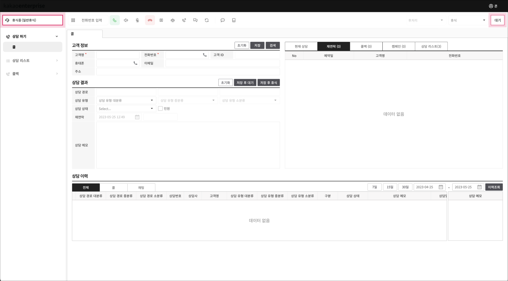

# 상담하기(전화)

## 콜 상담 

전화로 상담업무를 바로 진행할 수 있는 **콜 상담**입니다.

### 콜 상담 메뉴 구성 

상담 업무를 위한 페이지로 상담전화를 수신하고 상담 내역을 저장하고 필요에 따라 고객에게 상담전화를 발신할 수 있습니다.

### 콜 상담 인바운드 

인바운드 상담 전화를 통한 상담 업무를 바로 진행할 수 있는 **콜** 메뉴입니다.

#### 상담 준비

상담 애플리케이션으로 로그인 시 기본 상담사 상태는 “휴식 중”으로 설정됩니다.

* “휴식중”으로 설정된 상태에서는 인바운드 상담호 인입이 되지 않고 아웃바운드 상담호 발신만 가능한 상태가 됩니다.
* 우측 상단의 \[대기] 버튼을 클릭하면 상담사 상태가 “대기”로 설정되며, 이후부터 상담호 수신이 가능한 상태가 됩니다.

<figure><figcaption>
상담 준비
</figcaption></figure>

#### 콜 수신

상담사 “대기” 상태에서 인바운드 상담호가 착신되면 통화 팝업 화면이 표시됩니다.

* 기존에 등록된 고객의 경우 팝업과 동시에 고객정보란에 해당 고객정보가 표시되고 등록되지 않은 고객의 경우 신규 고객을 간편하게 등록하기 위해 고객정보란의 전화번호 필드에 인입된 호의 발신측 전화번호(고객 전화번호)가 자동으로 업데이트됩니다.
* 고객 1명이 당일(00시 00분 \~ 현재시각) 기준으로 상담호를 총 3회 시도하였다면 통화 팝업에는 두번째 통화부터 “재인입”으로 표시됩니다. ( 재인입은 상담사 구분없이 수신호 기준으로 count됨 )

<figure><figcaption>
콜 수신
</figcaption></figure>

#### 현재 상담

상담 통화 시에는 고객과 상담사의 대화 내역이 실시간으로 STT됩니다.

<figure><figcaption>
현재 상담
</figcaption></figure>

AI 상담봇에서 상담사로 호전환된 경우, “AI 상담봇에서 상담사로 전환되었습니다”라는 문구 노출과 함께 고객과 AI 상담봇의 상담 내역이 현재 상담 탭의 상단에 노출됩니다.

<figure><figcaption>
상담사로 전환
</figcaption></figure>

#### 상담 지식 검색

상담 지식 검색은 상담 애플리케이션의 지식 관리 시스템(Knowledge Management System, KMS)으로, 상담사는 상담 지식 검색을 통해 지식을 쉽고 빠르게 검색하여 정확한 지식을 전달할 수 있습니다.

상담 지식 검색의 데이터는 콘솔의 [지식 검색 설정](https://www.notion.so/389b1ec733584ac09c651ca88dcafc4b)에서 등록 가능합니다.

<figure><figcaption>
상담 지식 검색
</figcaption></figure>

검색은 3개까지 노출되며 X 버튼을 클릭하면 검색 결과를 지울 수 있습니다.

* 간편 검색: STT된 고객의 발화를 클릭하여 빠르게 검색이 가능합니다.
* 직접 검색: 검색창에 직접 키워드나 문장을 입력하여 검색할 수 있습니다.

<figure><figcaption>
상담 지식 검색 결과
</figcaption></figure>

<table><thead><tr><th width="114">구분</th><th>설명</th></tr></thead><tbody><tr><td>카테고리</td><td>해당 지식의 카테고리</td></tr><tr><td>지식 내용</td><td>상세 지식의 내용</td></tr><tr><td>키워드</td><td>대표번호 연결 시 해당 지식과 관련있는 키워드로, 검색의 조건</td></tr></tbody></table>

#### 상담 결과 저장

상담 통화 종료(고객과 상담사간 통화 연결이 끊어진 경우) 이후에 상담 내역을 저장할 수 있습니다.

* 상담 결과를 저장하지 않고 다음 인바운드 상담호를 받거나 아웃바운드 상담호를 시도할 수 없습니다.
* 상담 통화 종료 시 상담사 상태는 통화중에서 상담 내역을 저장할 수 있는 후처리 상태로 자동 전환됩니다.
* 고객명, 전화번호, 상담 유형, 상담 상태는 필수값으로, 해당 값들에 대한 입력과 선택이 없이는 저장이 불가합니다.&#x20;

<figure><figcaption>
상담 결과 저장
</figcaption></figure>

* 상담 결과 저장 후 다음 상담 전화를 수신하기를 원할 경우 \[저장 후 대기] 버튼을 실행하고, 상담 업무를 잠시 쉬어야할 경우 \[저장 후 휴식] 버튼을 실행하시기 바랍니다.

<figure><figcaption>
상담 메모
</figcaption></figure>

### 콜 상담 아웃바운드 

아웃바운드 상담 전화를 통한 상담업무를 바로 진행할 수 있는 “콜” 메뉴 입니다.

#### 콜 발신

아웃바운드 상담 호 발신은 상담사 상태가 “대기” 또는 ”휴식” 상태에서 가능합니다.

상담사 상태를 “대기”상태에서 아웃바운드 상담을 시도하는 경우 상담 종료 후 대기 상태에서 인바운드 상담호가 인입이 될 수 있습니다.  만약 아웃바운드 상담만 계속 시도할 경우 상담사 상태를 “휴식”으로 변경한 상태에서 시도하시기 바랍니다.

<figure><figcaption></figcaption></figure>

아웃바운드 상담 발신을 위한 방법은 키패드에 전화번호를 직접 입력하는 방식과 발신 목록을 선택해서 발신을 시도하는 2가지 방법을 제공합니다.

*   **키패드 발신**

    번호 입력 창에 키보드로 번호를 입력하거나, 키패드 아이콘을 클릭하여 번호를 입력할 수 있습니다.

    <figure><figcaption>
키패드 발신
</figcaption></figure>
*   **통화 목록 선택 발신**

    재연락, 콜백, 캠페인 등에 등록된 발신 통화 목록을 더블클릭하면 해당 전화번호가 키패드 창에 자동 업데이트됩니다.

    <figure><figcaption>
통화 목록 선택 발신
</figcaption></figure>

**미등록 고객 전화번호로 발신 시도**

미등록된 고객 전화번호로 발신을 시도할 경우 고객 등록을 간편하게 하기 위해서 전화번호 필드가 자동 업데이트됩니다.

<figure><figcaption>
미등록 고객 전화번호로 발신 시도
</figcaption></figure>

**등록 고객 전화번호로 발신 시도**

기존에 등록된 고객 전화번호 발신을 시도할 경우 발신과 동시에 고객정보란에 해당 고객의 정보가 자동으로 표시됩니다.

<figure><figcaption>
등록 고객 전화번호로 발신 시도
</figcaption></figure>

#### 상담 결과 저장

인바운드 콜 상담의 상담결과 저장과 동일하게 동작합니다.

### 콜 상담 부가 기능 

전화 상담 시 사용할 수 있는 부가 기능을 제공합니다.

#### 재연락

상담 완료 후 해당 고객과 재연락이 필요한 경우 상담사는 상담결과 저장 시 “재연락”으로 설정합니다.

* 재연락 탭에 등록된 목록 중 예약 시간 10분 전인 항목에 대해서는 빨간색으로 표시됩니다.
* 재연락 삭제는 해당 목록을 선택하여 아웃바운드 상담호를 진행하고 상담 결과를 저장해야만 삭제됩니다. ( 재연락 목록을 선택해서 발신하지 않고 키패드에 직접 입력해서 발신한 경우 재연락 목록에서는 삭제되지 않습니다. )

<figure><figcaption>
 재연락 설정
</figcaption></figure>

#### 통화 보류

상담 애플리케이션을 이용 하여 상담사와 고객간 상담 통화중에는 보류(상담사 음성 미 송신) 기능을 사용할 수 있습니다.

<figure><figcaption>
통화 보류
</figcaption></figure>

통화 보류를 실행 시 상담 고객에게 상담사의 음성 대신에 보류톤이 송출됩니다. 보류 버튼은 on/off 형태로 동작하며 보류 버튼을 한 번 더 클릭하면 보류 해제가 되어 고객과 상담사간 양방향 통화가 가능해집니다.

<figure><figcaption>
통화 보류 해제
</figcaption></figure>

#### 통화 전달(호 전환)

상담 애플리케이션을 이용하여 상담사와 고객간 상담 통화 중에는 호 전환(돌려주기) 기능을 이용하여 고객과 다른 상담사간 통화 연결을 시도할 수 있습니다.

고객과 상담사1 간에 상담통화 도중에 호전환 기능을 이용하여 상담사1은 통화를 종료하고 고객과 상담사2 간에 상담 통화를 진행할 수 있습니다.

<figure><figcaption>
통화 전달 호 전환
</figcaption></figure>

* 호 전환 절차는 키패드에 호전환을 시도할 전화번호를 먼저 입력하고 호전환 버튼을 클릭해야 합니다.
* 호 전환을 완료한 상담사1은 고객과 통화 종료가 되고 상담 이력 저장을 위한 후처리 상태로 전환됩니다.

#### 다자간 회의(3자 협의 통화)

상담 애플리케이션을 이용하여 상담사와 고객간 상담 통화중에 다자간 회의(협의 전환)기능을 이용하여 상담 고객과 상담사간에 다자간 회의(3자 회의 통화)를 진행할 수 있습니다.

<figure><figcaption>
다자간 회의 3자 협의 통화
</figcaption></figure>

3자간 협의 통화는 아래와 같은 절차로 진행됩니다.

<figure><figcaption>
3자 협의 통화
</figcaption></figure>

1. 상담 고객과 상담사1간에 상담 통화 도중에 협의(3자 회의 통화)가 필요한 경우 상담사2의 전화번호 입력 후 \[협의] 버튼을 클릭하여 협의 통화를 요청합니다.&#x20;
2. 이후 상담사1이 \[회의] 버튼을 추가로 클릭하면 상담고객 – 상담사1 – 상담사2 간에 3자 회의 통화가 구성됩니다.&#x20;
3.  3자간 협의 통화중에 상담사1이 먼저 호를 종료할 경우,  상담 결과 저장을 위한 “후처리” 상태로 변경이 되고 상담 고객과 상담사2의 상담 통화는 유지됩니다. 

    <figure><figcaption>
3자간 협의 통화
</figcaption></figure>

#### 다자간 회의(협의 전환)

상담 애플리케이션을 이용하여 상담사와 고객간 상담 통화 중에 다자간 회의(협의 전환)기능을 이용하여 상담 고객과 다른 상담사간 통화 연결을 구성할 수 있습니다.

* “협의 전환”의 경우 “호 전환” 과 동일하게 상담 고객과 상담사2간에 통화 연결은 되지만 통화 연결 Flow가 다릅니다.

<table><thead><tr><th width="249.33333333333331">조건</th><th>호 전환</th><th>협의 전환</th></tr></thead><tbody><tr><td>상담 고객과 상담사1간 통화 중</td><td>상담사1이 상담사2로 통화 연결을 시도하고 바로 호 종료</td><td>상담사1은 상담사2와 통화 연결이 된 이후에 호 종료</td></tr></tbody></table>

<figure><figcaption>
다자간 회의 협의 전환
</figcaption></figure>

<figure><figcaption>
다자간 회의 협의 전환
</figcaption></figure>

상담사1에서 협의 전환을 요청하고 호를 종료하게 되면 상담 결과 저장을 위한 “후처리” 상태로 변경이 되고 상담 고객과 상담사2간에 상담 통화가 연결됩니다.

**콜 상담 상태 변경 및 로그아웃**

상담사의 상태를 변경하거나 상담 화면을 로그아웃할 수 있습니다.

#### 상담사 상태 변경

상담 애플리케이션에서 상담사 상태는 4가지(대기 중, 상담 중, 후 처리, 휴식 중)이며 후 처리와 휴식은 10개의 세부 상태을 추가로 설정할 수 있습니다.

* 상담 애플리케이션 로그인시 Default 상담사 상태는 **휴식  중** 입니다.



인바운드 상담호는 “대기 중”에만 수신이 가능합니다. ( 아웃바운드 상담호 발신은 “대기 중” 또는 “휴식 중”에서도 가능)

* 상담사 상태를 “대기 중”으로 변경은 “휴식 중 ➡️ 대기” 상태로 변경과 “후처리 중 ➡️ 대기”상태로 변경 2가지 케이스만 제공합니다.



상담사가 고객과 상담 통화를 진행하고 있는 상태를 의미하며 상담 통화 중에 상담 결과를 입력을 할 수는 있지만 통화 종료 이후에 상담 결과를 저장할 수 있습니다.



상담 통화를 완료(호 종료)시 상담사 상태는 상담 결과 저장을 위한 “후 처리” 상태로 자동 변경됩니다.

“후처리 중” 상태에서 상담 결과를 저장하고 다음 인바운드 상담호 수신을 원할 경우 “저장 후 대기” 버튼을 클릭하고, 인바운드 상담호 수신을 원하지 않을 경우 “저장 후 휴식”으로 설정해야 합니다.

해당 상담 결과 저장을 위해 추가 작업(타부서 업무 협조, 관련 문서 검토, 관련 회의참석,,,) 등이 필요한 경우 후 처리 세부 상태를 선택합니다.

<figure><figcaption>
대기 중
</figcaption></figure>



상담 애플리케이션 로그인 시 Default 상담사 상태로 아웃바운드 상담호 발신이 가능한 상태입니다. “휴식 중” 상태의 경우 10가지의 세부 상태를 등록해서 상세 설정이 가능합니다.

<figure><figcaption>
휴식 중
</figcaption></figure>



#### 로그아웃

상담 애플리케이션에서 상담 관련 업무가 종료된 경우 로그아웃을 진행합니다.

* PC의 설정(절전모드, 화면 보호기)등으로 인해서 상담사별 상태 통계(대기중, 휴식 중, 로그아웃...)가 비정상적으로 계산되는 경우가 발생할 수 있습니다. 장시간 자리를 비우거나 업무가 종료된 경우 반드시 로그아웃을 실행하시기 바랍니다.

<figure><figcaption>
로그아웃
</figcaption></figure>

